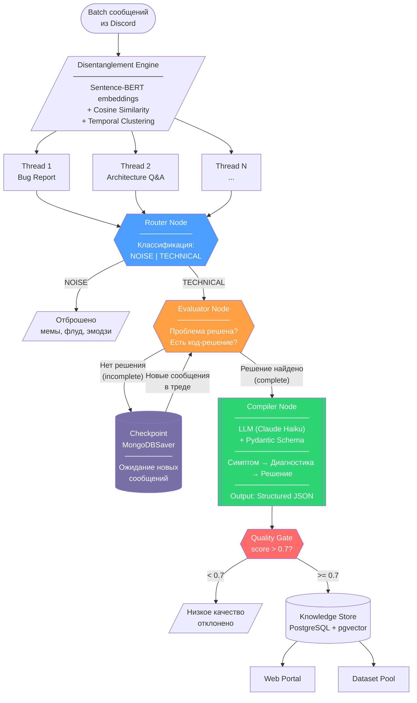
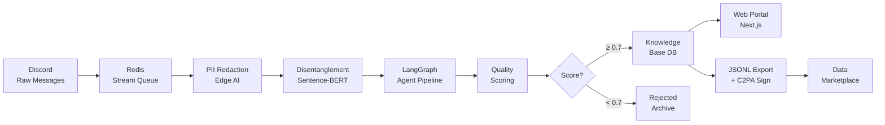
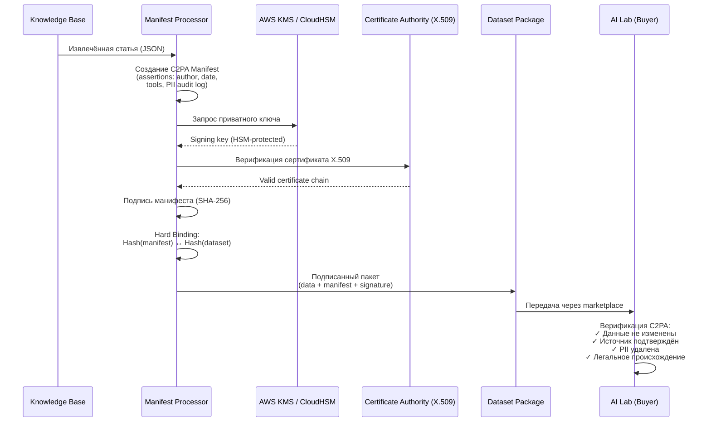

# NeuroWeave — Техническая Архитектура

> Децентрализованная платформа извлечения, анонимизации и лицензирования технических знаний из Discord-серверов

---

## 1. Архитектура верхнего уровня (System Overview)

```
┌─────────────────────────────────────────────────────────────────────────────────────┐
│                              DISCORD ECOSYSTEM                                      │
│                                                                                     │
│   ┌──────────┐  ┌──────────┐  ┌──────────┐  ┌──────────┐                           │
│   │ Server A │  │ Server B │  │ Server C │  │ Server N │  ...                       │
│   │ (React)  │  │ (Python) │  │ (Rust)   │  │ (Go)     │                           │
│   └────┬─────┘  └────┬─────┘  └────┬─────┘  └────┬─────┘                           │
│        │              │              │              │                                │
│        └──────────────┴──────┬───────┴──────────────┘                                │
│                              │ Discord Gateway / Webhooks                            │
└──────────────────────────────┼──────────────────────────────────────────────────────┘
                               │
                               ▼
┌──────────────────────────────────────────────────────────────────────────────────────┐
│                         INGESTION LAYER (Сбор данных)                                │
│                                                                                      │
│  ┌─────────────────────┐     ┌──────────────────────┐     ┌───────────────────────┐  │
│  │   Discord Bot        │     │   Message Queue       │     │   Raw Message Store   │  │
│  │   (discord.py)       │────▶│   (Redis Streams)     │────▶│   (PostgreSQL)        │  │
│  │                      │     │                       │     │                       │  │
│  │  - Gateway Events    │     │  - Buffering          │     │  - messages table     │  │
│  │  - Slash Commands    │     │  - Backpressure       │     │  - channels table     │  │
│  │  - GDPR Consent UI   │     │  - Rate Limiting      │     │  - servers table      │  │
│  └─────────────────────┘     └──────────────────────┘     └───────────┬───────────┘  │
└───────────────────────────────────────────────────────────────────────┼───────────────┘
                                                                       │
                                                                       ▼
┌──────────────────────────────────────────────────────────────────────────────────────┐
│                    PRIVACY LAYER (Периферийная анонимизация)                          │
│                                                                                      │
│  ┌─────────────────────┐     ┌──────────────────────┐     ┌───────────────────────┐  │
│  │  PII Detection       │     │  PII Redaction        │     │  Audit Logger         │  │
│  │  (Llama 3.2 1B       │────▶│  (Regex + AI Model)   │────▶│  (Immutable Log)      │  │
│  │   PII-Redact, CPU)   │     │                       │     │                       │  │
│  │                      │     │  user@mail.com →      │     │  - PII found count    │  │
│  │  - NER pipeline      │     │    <PII:EMAIL>        │     │  - Redaction proof    │  │
│  │  - Context-aware     │     │  John Smith →         │     │  - Timestamp + hash   │  │
│  │  - Quantized (INT8)  │     │    <PII:PERSON>       │     │                       │  │
│  └─────────────────────┘     └──────────────────────┘     └───────────┬───────────┘  │
└───────────────────────────────────────────────────────────────────────┼───────────────┘
                                                                       │
                                                                       ▼
┌──────────────────────────────────────────────────────────────────────────────────────┐
│               EXTRACTION LAYER (Многоагентное извлечение знаний)                      │
│                                                                                      │
│  ┌─────────────────────┐     ┌──────────────────────┐     ┌───────────────────────┐  │
│  │  Disentanglement     │     │  LangGraph Agents     │     │  Knowledge Store      │  │
│  │  Engine              │────▶│  (StateGraph)         │────▶│  (PostgreSQL +        │  │
│  │                      │     │                       │     │   pgvector)           │  │
│  │  - Sentence-BERT     │     │  - Router Node        │     │                       │  │
│  │  - Cosine Similarity │     │  - Evaluator Node     │     │  - articles table     │  │
│  │  - Temporal Cluster  │     │  - Compiler Node      │     │  - embeddings         │  │
│  └─────────────────────┘     └──────────────────────┘     └───────────┬───────────┘  │
└───────────────────────────────────────────────────────────────────────┼───────────────┘
                                                                       │
                               ┌────────────────────────────────────────┤
                               │                                        │
                               ▼                                        ▼
┌──────────────────────────────────────┐  ┌────────────────────────────────────────────┐
│      PRESENTATION LAYER              │  │        DATA COMMERCE LAYER                 │
│      (Веб-портал знаний)             │  │        (Упаковка и продажа данных)         │
│                                      │  │                                            │
│  ┌────────────────────────────────┐  │  │  ┌──────────────────────────────────────┐  │
│  │  Next.js Web Portal            │  │  │  │  C2PA Signing Engine                 │  │
│  │  - SSR / SEO-optimized         │  │  │  │  - Manifest Creation                │  │
│  │  - /server-slug/article        │  │  │  │  - X.509 Digital Signatures         │  │
│  │  - Semantic Search             │  │  │  │  - Hard Bindings (SHA-256)          │  │
│  │  - Admin Dashboard             │  │  │  └──────────────┬───────────────────────┘  │
│  └────────────────────────────────┘  │  │                 │                          │
│                                      │  │                 ▼                          │
│  ┌────────────────────────────────┐  │  │  ┌──────────────────────────────────────┐  │
│  │  Discord In-Chat Search        │  │  │  │  Dataset Packager                    │  │
│  │  - /nw-ask <question>          │  │  │  │  - JSONL / JSON / Markdown export    │  │
│  │  - Ephemeral responses         │  │  │  │  - Schema documentation              │  │
│  └────────────────────────────────┘  │  │  │  - Audit trail bundling              │  │
│                                      │  │  └──────────────┬───────────────────────┘  │
└──────────────────────────────────────┘  │                 │                          │
                                          │                 ▼                          │
                                          │  ┌──────────────────────────────────────┐  │
                                          │  │  Marketplace Distribution             │  │
                                          │  │  - Opendatabay / Datarade             │  │
                                          │  │  - Databricks / Snowflake Mktplace    │  │
                                          │  │  - Direct API (DaaS subscriptions)    │  │
                                          │  └──────────────────────────────────────┘  │
                                          └────────────────────────────────────────────┘

                               ┌────────────────────────────────────────┐
                               │        PAYMENT LAYER                   │
                               │                                        │
                               │  Stripe Connect                        │
                               │  - Platform Account                    │
                               │  - Connected Accounts (admins)         │
                               │  - Automated Revenue Share             │
                               │  - KYC / AML delegation                │
                               └────────────────────────────────────────┘
```

---

## 2. Четыре технологических столпа

```
                    ┌──────────────────────────────────────┐
                    │         NeuroWeave Platform           │
                    └──────────────┬───────────────────────┘
                                   │
            ┌──────────────────────┼──────────────────────┐
            │                      │                      │
            ▼                      ▼                      ▼
  ┌─────────────────┐  ┌─────────────────┐  ┌─────────────────┐  ┌─────────────────┐
  │   СТОЛП 1       │  │   СТОЛП 2       │  │   СТОЛП 3       │  │   СТОЛП 4       │
  │                 │  │                 │  │                 │  │                 │
  │  Agentic        │  │  Privacy-       │  │  Digital        │  │  Decentralized  │
  │  Extraction     │  │  Preserving     │  │  Provenance     │  │  Economy        │
  │  Layer          │  │  Edge AI        │  │  (C2PA)         │  │  (Data Unions)  │
  │                 │  │                 │  │                 │  │                 │
  │  LangGraph      │  │  Llama PII      │  │  C2PA Python    │  │  Stripe         │
  │  Multi-Agent    │  │  Redact         │  │  SDK            │  │  Connect        │
  │  StateGraph     │  │  Zero-trust     │  │  X.509 Certs    │  │  Revenue Share  │
  │  Pydantic       │  │  CPU-only       │  │  AWS KMS        │  │  KYC/AML       │
  └─────────────────┘  └─────────────────┘  └─────────────────┘  └─────────────────┘
         │                      │                    │                    │
         ▼                      ▼                    ▼                    ▼
  ┌─────────────┐      ┌──────────────┐     ┌──────────────┐    ┌──────────────┐
  │ Structured  │      │ Clean text   │     │ Certified    │    │ Automated    │
  │ Knowledge   │      │ without PII  │     │ datasets     │    │ payouts to   │
  │ Base (JSON) │      │ (GDPR-safe)  │     │ (tamper-     │    │ communities  │
  │             │      │              │     │  proof)      │    │              │
  └─────────────┘      └──────────────┘     └──────────────┘    └──────────────┘
```

---

## 3. LangGraph: Граф многоагентного извлечения



### ASCII-версия графа агентов

```
    ┌───────────────────────────────────────────────────────────────────┐
    │                   Batch сообщений из Discord                      │
    └───────────────────────────┬───────────────────────────────────────┘
                                │
                                ▼
    ┌───────────────────────────────────────────────────────────────────┐
    │              DISENTANGLEMENT ENGINE                                │
    │                                                                   │
    │    Sentence-BERT → Embeddings → Cosine Similarity Matrix          │
    │    + Temporal proximity + @mentions + quote refs                   │
    │                                                                   │
    │    Threshold > 0.75 → Group into logical thread                   │
    └────────┬──────────────────┬──────────────────┬────────────────────┘
             │                  │                  │
             ▼                  ▼                  ▼
      ┌────────────┐    ┌────────────┐    ┌────────────────┐
      │  Thread 1   │    │  Thread 2   │    │  Thread N ...  │
      │  Bug Report │    │  Q&A        │    │                │
      └──────┬─────┘    └──────┬─────┘    └───────┬────────┘
             │                  │                   │
             └──────────────────┴─────┬─────────────┘
                                      │
                                      ▼
                    ┌─────────────────────────────────┐
                    │         ROUTER NODE              │
                    │   ┌───────────────────────────┐  │
                    │   │ Classify: NOISE or TECH   │  │
                    │   │ Update: AgentState        │  │
                    │   └───────────┬───────────────┘  │
                    └───────────────┼──────────────────┘
                           ┌────────┴────────┐
                           │                 │
                      NOISE │            TECH │
                           │                 │
                           ▼                 ▼
                    ┌────────────┐   ┌──────────────────────────┐
                    │  DISCARD   │   │    EVALUATOR NODE        │
                    │  (skip)    │   │                          │◄──────────────┐
                    └────────────┘   │  Is problem resolved?    │               │
                                     │  Has code solution?      │               │
                                     └──────────┬───────────────┘               │
                                        ┌───────┴───────┐                       │
                                        │               │                       │
                                   NO   │          YES  │                       │
                                        │               │                       │
                                        ▼               ▼                       │
                              ┌───────────────┐ ┌──────────────────┐            │
                              │  CHECKPOINT    │ │  COMPILER NODE   │            │
                              │  (Wait State)  │ │                  │            │
                              │  ────────────  │ │  LLM: Claude     │            │
                              │  Save context  │ │  Haiku           │            │
                              │  to MongoDB/   │ │                  │            │
                              │  InMemory      │ │  Schema:         │            │
                              │                │ │  {symptom,       │            │
                              │  Await new     │ │   diagnosis,     │            │
                              │  messages...   │ │   solution,      │            │
                              └───────┬───────┘ │   code_snippet,   │            │
                                      │         │   tags[]}         │            │
                              New msg  │         │                  │            │
                                      └─────────┼──────────────────┘            │
                                                │         │                     │
                                                │    Cyclic edge (retry)        │
                                                │         └─────────────────────┘
                                                ▼
                                     ┌─────────────────────┐
                                     │   QUALITY GATE       │
                                     │   Score >= 0.7?      │
                                     └──────────┬──────────┘
                                        ┌───────┴───────┐
                                        │               │
                                   PASS │          FAIL │
                                        ▼               ▼
                              ┌──────────────┐  ┌────────────┐
                              │  KNOWLEDGE    │  │  REJECTED  │
                              │  STORE        │  │  (logged)  │
                              │  ──────────── │  └────────────┘
                              │  PostgreSQL   │
                              │  + pgvector   │
                              └──────────────┘
```

---

## 4. Pipeline обработки данных (Data Flow)



### ASCII-версия Data Flow

```
                              PIPELINE ОБРАБОТКИ ДАННЫХ
  ══════════════════════════════════════════════════════════════════════════

  ┌─────────┐    ┌─────────┐    ┌──────────────┐    ┌──────────────────┐
  │ Discord │    │ Redis   │    │ PII          │    │ Disentanglement  │
  │ Gateway │───▶│ Streams │───▶│ Redaction    │───▶│ Engine           │
  │         │    │ Queue   │    │ (Edge AI)    │    │ (Sentence-BERT)  │
  └─────────┘    └─────────┘    └──────────────┘    └────────┬─────────┘
                                                              │
  Формат:                                                     │
  Raw JSON events           <PII:EMAIL>               Clustered Threads
  ~1000 msg/min             <PII:PERSON>              cosine > 0.75
                            <PII:IP>
                                                              │
                                                              ▼
  ┌─────────────────────────────────────────────────────────────────────┐
  │                    LANGGRAPH MULTI-AGENT PIPELINE                    │
  │                                                                     │
  │   ┌──────────┐    ┌─────────────┐    ┌────────────┐                │
  │   │ Router   │───▶│ Evaluator   │───▶│ Compiler   │                │
  │   │ Node     │    │ Node        │    │ Node       │                │
  │   │          │    │ (cyclical)  │    │ (Pydantic) │                │
  │   └──────────┘    └─────────────┘    └──────┬─────┘                │
  └─────────────────────────────────────────────┼───────────────────────┘
                                                │
                                                ▼
                                     ┌─────────────────┐
                                     │  Quality Gate    │
                                     │  Score >= 0.7    │
                                     └────────┬────────┘
                                              │
                              ┌───────────────┼───────────────┐
                              │               │               │
                              ▼               ▼               ▼
                    ┌──────────────┐ ┌──────────────┐ ┌──────────────┐
                    │ Knowledge    │ │  C2PA Signed │ │  JSONL       │
                    │ Base         │ │  Manifest    │ │  Export      │
                    │ (PostgreSQL) │ │  (X.509)     │ │  (Dataset)   │
                    └──────┬───────┘ └──────┬───────┘ └──────┬───────┘
                           │                │                │
                    ┌──────┴───────┐        └────────┬───────┘
                    │              │                  │
                    ▼              ▼                  ▼
              ┌──────────┐  ┌──────────┐    ┌──────────────────┐
              │ Web      │  │ Discord  │    │ Data Marketplace │
              │ Portal   │  │ /nw-ask  │    │ (Opendatabay,    │
              │ (Next.js)│  │ command  │    │  Datarade, etc.) │
              └──────────┘  └──────────┘    └──────────────────┘
```

---

## 5. Архитектура PII-анонимизации (Edge AI)

```
             ZERO-TRUST PRIVACY PIPELINE
  ═══════════════════════════════════════════════════════

     Сырое сообщение из Discord
     ─────────────────────────────────────
     "Hey @JohnSmith, my server at 192.168.1.50
      crashes with OOM. Email me at john@acme.com
      Here's the stacktrace: ..."
                    │
                    ▼
  ┌──────────────────────────────────────────────────┐
  │          STAGE 1: Regex Pre-Filter               │
  │                                                  │
  │  Patterns:                                       │
  │  ├── Email:  /[\w.-]+@[\w.-]+\.\w+/             │
  │  ├── IP:     /\d{1,3}\.\d{1,3}\.\d{1,3}\.\d+/  │
  │  ├── Phone:  /\+?\d{10,15}/                     │
  │  ├── URLs with tokens                            │
  │  └── API Keys / Secrets                          │
  │                                                  │
  │  Confidence: ~70% recall                         │
  └───────────────────────┬──────────────────────────┘
                          │
                          ▼
  ┌──────────────────────────────────────────────────┐
  │          STAGE 2: AI Model (NER)                 │
  │                                                  │
  │  Model: Llama 3.2 1B PII-Redact                 │
  │  Runtime: CPU-only (INT8 quantized)              │
  │  Latency: < 500ms per message                   │
  │                                                  │
  │  Detected entities:                              │
  │  ├── PERSON: "JohnSmith" → <PII:PERSON_1>       │
  │  ├── IP_ADDR: "192.168.1.50" → <PII:IP>         │
  │  ├── EMAIL: "john@acme.com" → <PII:EMAIL>       │
  │  └── Context-aware detection                     │
  │      (understands sentence structure)            │
  │                                                  │
  │  Confidence: ~95% recall                         │
  └───────────────────────┬──────────────────────────┘
                          │
                          ▼
  ┌──────────────────────────────────────────────────┐
  │          STAGE 3: Irreversible Replacement       │
  │                                                  │
  │  "Hey <PII:PERSON_1>, my server at <PII:IP>     │
  │   crashes with OOM. Email me at <PII:EMAIL>     │
  │   Here's the stacktrace: ..."                   │
  │                                                  │
  │  ⚠ Original PII is NEVER stored                 │
  │  ⚠ Replacement is ONE-WAY (no mapping table)    │
  └───────────────────────┬──────────────────────────┘
                          │
                          ▼
  ┌──────────────────────────────────────────────────┐
  │          STAGE 4: Audit Log                      │
  │                                                  │
  │  {                                               │
  │    "message_hash": "sha256:abc...",              │
  │    "timestamp": "2026-02-21T14:30:00Z",         │
  │    "pii_entities_found": 3,                      │
  │    "entity_types": ["PERSON","IP","EMAIL"],      │
  │    "model_version": "llama-3.2-1b-pii-v2",      │
  │    "processing_ms": 342                          │
  │  }                                               │
  │                                                  │
  │  → Immutable audit trail for GDPR compliance     │
  └──────────────────────────────────────────────────┘
```

---

## 6. Протокол цифрового провенанса (C2PA)



### ASCII-версия C2PA Flow

```
  ┌──────────────┐
  │ Knowledge    │
  │ Base Article │
  │ (clean JSON) │
  └──────┬───────┘
         │
         ▼
  ┌──────────────────────────────────────────────────────────────────┐
  │                    C2PA MANIFEST CREATION                        │
  │                                                                  │
  │  Assertions (метаданные):                                       │
  │  ┌────────────────────────────────────────────────────────────┐  │
  │  │  {                                                        │  │
  │  │    "dc:title": "Python Debug Solutions Q4-2026",          │  │
  │  │    "dc:creator": "NeuroWeave Platform",                   │  │
  │  │    "c2pa.created": "2026-02-21T10:00:00Z",               │  │
  │  │    "c2pa.actions": [                                      │  │
  │  │      {"action": "c2pa.collected", "source": "discord"},   │  │
  │  │      {"action": "c2pa.anonymized", "tool": "pii-redact"},│  │
  │  │      {"action": "c2pa.compiled", "tool": "langgraph"}    │  │
  │  │    ],                                                     │  │
  │  │    "pii_audit": "sha256:audit_log_hash...",              │  │
  │  │    "consent_proof": "sha256:consent_db_hash..."          │  │
  │  │  }                                                        │  │
  │  └────────────────────────────────────────────────────────────┘  │
  └──────────────────────────┬───────────────────────────────────────┘
                             │
                             ▼
  ┌──────────────────────────────────────────────────────────────────┐
  │                 CRYPTOGRAPHIC SIGNING                             │
  │                                                                  │
  │     ┌──────────────┐        ┌─────────────────────┐             │
  │     │ AWS KMS /    │        │ X.509 Certificate   │             │
  │     │ CloudHSM     │        │ (Trusted CA)        │             │
  │     │              │        │                     │             │
  │     │ Private Key  │        │ Public Key Chain    │             │
  │     │ (HSM-stored) │        │ for verification    │             │
  │     └──────┬───────┘        └──────────┬──────────┘             │
  │            │                           │                         │
  │            └───────────┬───────────────┘                         │
  │                        │                                         │
  │                        ▼                                         │
  │            ┌──────────────────────┐                              │
  │            │  SHA-256 Signature   │                              │
  │            │  of Manifest         │                              │
  │            └──────────┬───────────┘                              │
  │                       │                                          │
  │                       ▼                                          │
  │            ┌──────────────────────┐                              │
  │            │  HARD BINDING        │                              │
  │            │                      │                              │
  │            │  Hash(manifest) ←──→ │                              │
  │            │  Hash(dataset.jsonl) │                              │
  │            │                      │                              │
  │            │  Tamper = detected   │                              │
  │            └──────────────────────┘                              │
  └──────────────────────────────────────────────────────────────────┘
                             │
                             ▼
                  ┌─────────────────────┐
                  │  CERTIFIED DATASET  │
                  │  ═══════════════    │
                  │  data.jsonl         │
                  │  manifest.c2pa      │
                  │  signature.sig      │
                  │  audit_log.json     │
                  │  certificate.pem    │
                  └─────────────────────┘
```

---

## 7. GDPR Consent Flow (UX бота)

```
  Пользователь впервые пишет на сервере с NeuroWeave ботом
  ════════════════════════════════════════════════════════════

  ┌────────────────────────────────────────────────────────────────┐
  │  Discord Chat                                                  │
  │                                                                │
  │  👤 NewUser: "How do I fix CORS errors in Next.js?"           │
  │                                                                │
  └────────────────────────────────────────────────────────────────┘
                               │
                               │ Bot detects: first message from user
                               ▼
  ┌────────────────────────────────────────────────────────────────┐
  │  ⚡ Ephemeral Message (visible only to NewUser)               │
  │  ─────────────────────────────────────────────                │
  │                                                                │
  │  🔒 NeuroWeave Privacy Notice                                 │
  │                                                                │
  │  This server uses NeuroWeave to build a knowledge base        │
  │  from technical discussions. Your messages may be:             │
  │                                                                │
  │  Please choose your preferences:                               │
  │                                                                │
  │  ┌──────────────────────────────────────────────────────────┐  │
  │  │ ☐ Knowledge Base                                        │  │
  │  │   Allow my messages to be used for the community's      │  │
  │  │   internal knowledge base (FAQ portal)                   │  │
  │  └──────────────────────────────────────────────────────────┘  │
  │                                                                │
  │  ┌──────────────────────────────────────────────────────────┐  │
  │  │ ☐ AI Training Data                                      │  │
  │  │   Allow anonymized versions of my messages to be        │  │
  │  │   licensed to AI companies (all PII removed)            │  │
  │  └──────────────────────────────────────────────────────────┘  │
  │                                                                │
  │  [ ✅ Accept Selected ]    [ ❌ Decline All ]                  │
  │                                                                │
  │  ℹ️ Change anytime: /privacy config                           │
  │  📄 Full policy: neuroweave.dev/privacy                       │
  │                                                                │
  └────────────────────────────────────────────────────────────────┘
                               │
                      ┌────────┴────────┐
                      │                 │
               Accept │          Decline│
                      ▼                 ▼
  ┌─────────────────────────┐  ┌─────────────────────────┐
  │ consent_records table   │  │ User excluded from       │
  │                         │  │ all data processing      │
  │ user_hash: sha256(id)   │  │                         │
  │ kb_consent: true/false  │  │ Messages pass through   │
  │ ai_consent: true/false  │  │ but are NEVER collected │
  │ granted_at: timestamp   │  └─────────────────────────┘
  │ server_id: ...          │
  │ revocable: true         │
  └─────────────────────────┘

         /privacy config
              │
              ▼
  ┌─────────────────────────────────────────────────────┐
  │  Revocation Flow:                                    │
  │                                                     │
  │  1. User runs /privacy config                        │
  │  2. Bot shows current settings (ephemeral)           │
  │  3. User toggles off any consent                     │
  │  4. DB trigger fires:                                │
  │     → Mark all user's messages as "revoked"          │
  │     → Remove from pending dataset exports            │
  │     → Re-generate affected articles without          │
  │       this user's contributions                      │
  │  5. Confirmation sent (ephemeral)                    │
  └─────────────────────────────────────────────────────┘
```

---

## 8. Схема базы данных

```
  ┌───────────────────────────────────────────────────────────────────┐
  │                        DATABASE SCHEMA                             │
  │                     PostgreSQL + pgvector                           │
  └───────────────────────────────────────────────────────────────────┘

  ┌─────────────────────┐       ┌──────────────────────┐
  │      servers         │       │      channels         │
  ├─────────────────────┤       ├──────────────────────┤
  │ id          PK      │───┐   │ id           PK      │
  │ discord_id  UNIQUE  │   │   │ server_id    FK ─────│──┐
  │ name        TEXT    │   │   │ discord_id   UNIQUE  │  │
  │ icon_url    TEXT    │   │   │ name         TEXT    │  │
  │ settings    JSONB   │   │   │ is_monitored BOOL   │  │
  │ plan        ENUM    │   │   │ created_at   TSTZ   │  │
  │ created_at  TSTZ    │   │   └──────────────────────┘  │
  └─────────────────────┘   │                              │
                            │   ┌──────────────────────┐   │
                            │   │    consent_records    │   │
                            │   ├──────────────────────┤   │
                            │   │ id           PK      │   │
                            └──▶│ server_id    FK      │   │
                                │ user_hash    TEXT    │   │
                                │ kb_consent   BOOL   │   │
                                │ ai_consent   BOOL   │   │
                                │ granted_at   TSTZ   │   │
                                │ revoked_at   TSTZ?  │   │
                                │ ip_country   TEXT   │   │
                                └──────────────────────┘   │
                                                           │
  ┌─────────────────────┐       ┌──────────────────────┐   │
  │      messages        │       │      threads          │   │
  ├─────────────────────┤       ├──────────────────────┤   │
  │ id          PK      │   ┌──▶│ id           PK      │   │
  │ channel_id  FK ─────│───│──▶│ channel_id   FK ─────│───┘
  │ discord_msg_id      │   │   │ topic        TEXT    │
  │ author_hash TEXT    │   │   │ message_ids  JSONB   │
  │ content_redacted    │   │   │ status       ENUM   │
  │   TEXT              │   │   │   (open|closed|     │
  │ has_code    BOOL   │   │   │    compiled)        │
  │ embedding          │   │   │ created_at   TSTZ   │
  │   vector(384)      │   │   │ closed_at    TSTZ?  │
  │ thread_id   FK ────│───┘   └──────────────────────┘
  │ consent_status     │
  │   ENUM             │       ┌──────────────────────────────┐
  │ created_at  TSTZ   │       │        articles               │
  │ processed   BOOL   │       ├──────────────────────────────┤
  └─────────────────────┘       │ id              PK           │
                                │ server_id       FK           │
                                │ thread_id       FK           │
                                │ title           TEXT         │
                                │ content_md      TEXT         │
                                │ summary         TEXT         │
                                │ structured_json JSONB        │
                                │   {symptom, diagnosis,       │
                                │    solution, code_snippet}   │
                                │ category        TEXT         │
                                │ tags            TEXT[]       │
                                │ quality_score   FLOAT        │
                                │ embedding       vector(1536) │
                                │ view_count      INT          │
                                │ c2pa_manifest_hash TEXT      │
                                │ created_at      TSTZ         │
                                │ updated_at      TSTZ         │
                                └──────────────────────────────┘

  ┌──────────────────────────────┐    ┌──────────────────────────────┐
  │     dataset_exports          │    │     pii_audit_logs           │
  ├──────────────────────────────┤    ├──────────────────────────────┤
  │ id              PK           │    │ id              PK           │
  │ name            TEXT         │    │ message_id      FK           │
  │ format          ENUM         │    │ entities_found  INT          │
  │   (jsonl|json|markdown)      │    │ entity_types    TEXT[]       │
  │ article_ids     INT[]        │    │ model_version   TEXT         │
  │ c2pa_signed     BOOL         │    │ processing_ms   INT          │
  │ manifest_url    TEXT         │    │ created_at      TSTZ         │
  │ total_tokens    BIGINT       │    └──────────────────────────────┘
  │ created_at      TSTZ         │
  │ sold_to         TEXT?        │    ┌──────────────────────────────┐
  │ license_type    TEXT?        │    │     stripe_accounts          │
  └──────────────────────────────┘    ├──────────────────────────────┤
                                      │ id              PK           │
                                      │ server_id       FK           │
                                      │ stripe_account_id TEXT       │
                                      │ admin_user_hash TEXT         │
                                      │ onboarded       BOOL         │
                                      │ total_earned    DECIMAL      │
                                      │ created_at      TSTZ         │
                                      └──────────────────────────────┘
```

---

## 9. Архитектура платежей (Stripe Connect)

```
  ┌────────────────────────────────────────────────────────────────────┐
  │                   REVENUE FLOW: DATA SALE                          │
  └────────────────────────────────────────────────────────────────────┘

    AI Lab (Buyer)                    NeuroWeave Platform
    ──────────────                    ──────────────────
         │
         │  Purchase: "Python Debug Dataset Q4-2026"
         │  Price: $50,000
         │
         ▼
    ┌──────────┐         ┌──────────────────────────────────────────┐
    │ Payment  │────────▶│          Stripe Platform Account         │
    │ $50,000  │         │                                          │
    └──────────┘         │  Revenue Split Logic:                    │
                         │                                          │
                         │  ┌────────────────────────────────────┐  │
                         │  │ Platform Fee: 25% = $12,500        │  │
                         │  │ (infra, AI, C2PA, compliance)      │  │
                         │  └────────────────────────────────────┘  │
                         │                                          │
                         │  ┌────────────────────────────────────┐  │
                         │  │ Community Pool: 75% = $37,500      │  │
                         │  │                                    │  │
                         │  │ Distribution by contribution:      │  │
                         │  │                                    │  │
                         │  │  Server A (React)                  │  │
                         │  │  ├─ 45% of articles in dataset     │  │
                         │  │  ├─ Share: $16,875                 │  │
                         │  │  └─▶ Connected Account A           │  │
                         │  │                                    │  │
                         │  │  Server B (Python)                 │  │
                         │  │  ├─ 35% of articles in dataset     │  │
                         │  │  ├─ Share: $13,125                 │  │
                         │  │  └─▶ Connected Account B           │  │
                         │  │                                    │  │
                         │  │  Server C (Rust)                   │  │
                         │  │  ├─ 20% of articles in dataset     │  │
                         │  │  ├─ Share: $7,500                  │  │
                         │  │  └─▶ Connected Account C           │  │
                         │  └────────────────────────────────────┘  │
                         └──────────────────────────────────────────┘
                                          │
                         ┌────────────────┼────────────────┐
                         │                │                │
                         ▼                ▼                ▼
                  ┌────────────┐  ┌────────────┐  ┌────────────┐
                  │ Admin A    │  │ Admin B    │  │ Admin C    │
                  │ Bank Acct  │  │ Bank Acct  │  │ Bank Acct  │
                  │ $16,875    │  │ $13,125    │  │ $7,500     │
                  └────────────┘  └────────────┘  └────────────┘

  Stripe handles: KYC ✓  AML ✓  Tax reporting ✓  Global payouts ✓
```

---

## 10. Технологический стек

```
  ┌────────────────────────────────────────────────────────────────────┐
  │                     TECHNOLOGY STACK MAP                            │
  └────────────────────────────────────────────────────────────────────┘

  LAYER                    TECHNOLOGY                      PURPOSE
  ═══════════════════════════════════════════════════════════════════════

  Discord Integration      discord.py                      Bot framework
                           Discord Gateway API              Real-time events
                           Discord OAuth2                   Admin auth

  Message Queue            Redis Streams                    Buffering, backpressure
                           Celery                           Async task processing

  PII Anonymization        Llama 3.2 1B PII-Redact         AI-based NER (CPU)
                           pii-redact (Python)              Library wrapper
                           Regex pre-filters                Deterministic layer

  Disentanglement          sentence-transformers            Embeddings (384d)
                           scikit-learn                     Cosine similarity
                           Custom temporal clustering       Time-based grouping

  Agent Orchestration      LangGraph (StateGraph)           Graph-based agents
                           LangChain                        LLM integrations
                           Claude Haiku API                 Fast + cheap compilation
                           Pydantic v2                      Schema validation

  Database                 PostgreSQL 16                    Primary data store
                           pgvector extension               Vector similarity search
                           Full-text search (tsvector)      Keyword search

  Digital Provenance       C2PA Python SDK                  Manifest creation
                           AWS KMS / CloudHSM               Key management
                           X.509 certificates               Digital signatures

  Web Portal               Next.js 14 (App Router)          SSR + SEO
                           TypeScript                       Type safety
                           Tailwind CSS                     Styling
                           shadcn/ui                        UI components

  Payments                 Stripe Connect                   Revenue distribution
                           Stripe API                       Billing + payouts

  Infrastructure           Docker Compose                   Local dev + MVP deploy
                           Hetzner / DigitalOcean VPS       Hosting
                           GitHub Actions                   CI/CD
                           Sentry                           Error monitoring
                           Prometheus + Grafana              Metrics (post-MVP)

  ═══════════════════════════════════════════════════════════════════════
```

---

## 11. Инфраструктура деплоя (MVP)

```
  ┌────────────────────────────────────────────────────────────────────┐
  │                         VPS (Hetzner CCX33)                        │
  │                         8 vCPU / 32GB RAM / 240GB NVMe             │
  │                         ~€50/month                                 │
  │                                                                    │
  │  ┌──────────────────────────── Docker Compose ──────────────────┐  │
  │  │                                                              │  │
  │  │  ┌──────────────┐  ┌──────────────┐  ┌──────────────────┐   │  │
  │  │  │  bot          │  │  api          │  │  web              │   │  │
  │  │  │  (Python)     │  │  (FastAPI)    │  │  (Next.js)       │   │  │
  │  │  │  Port: -      │  │  Port: 8000  │  │  Port: 3000      │   │  │
  │  │  │              │  │              │  │                  │   │  │
  │  │  │  discord.py   │  │  Uvicorn     │  │  Node 20         │   │  │
  │  │  │  + Celery     │  │  workers: 4  │  │  SSR mode        │   │  │
  │  │  │    worker     │  │              │  │                  │   │  │
  │  │  └──────────────┘  └──────────────┘  └──────────────────┘   │  │
  │  │                                                              │  │
  │  │  ┌──────────────┐  ┌──────────────┐  ┌──────────────────┐   │  │
  │  │  │  postgres     │  │  redis        │  │  pii-model       │   │  │
  │  │  │              │  │              │  │  (Llama 1B)      │   │  │
  │  │  │  Port: 5432  │  │  Port: 6379  │  │  CPU inference   │   │  │
  │  │  │  + pgvector   │  │  Streams +   │  │  INT8 quantized  │   │  │
  │  │  │  16GB RAM    │  │  Cache        │  │  ~2GB RAM        │   │  │
  │  │  └──────────────┘  └──────────────┘  └──────────────────┘   │  │
  │  │                                                              │  │
  │  │  ┌──────────────────────────────────────────────────────┐   │  │
  │  │  │  nginx (reverse proxy)                                │   │  │
  │  │  │  - SSL termination (Let's Encrypt)                   │   │  │
  │  │  │  - api.neuroweave.dev → :8000                        │   │  │
  │  │  │  - neuroweave.dev → :3000                            │   │  │
  │  │  │  - Rate limiting                                      │   │  │
  │  │  └──────────────────────────────────────────────────────┘   │  │
  │  └──────────────────────────────────────────────────────────────┘  │
  │                                                                    │
  │  Volumes:                                                          │
  │  ├── /data/postgres     (persistent)                               │
  │  ├── /data/redis        (persistent)                               │
  │  └── /data/exports      (dataset JSONL files)                      │
  │                                                                    │
  └────────────────────────────────────────────────────────────────────┘

  External Services:
  ├── Anthropic API (Claude Haiku) — LLM compilation
  ├── Stripe Connect — payments
  ├── AWS KMS — C2PA key management
  ├── Sentry — error tracking
  └── GitHub Actions — CI/CD
```

---

## 12. Бизнес-модель: Два вектора

```
  ═══════════════════════════════════════════════════════════════════════
             DUAL REVENUE MODEL: DaaS + B2B SaaS
  ═══════════════════════════════════════════════════════════════════════

  ВЕКТОР 1: DaaS (Data-as-a-Service)          ВЕКТОР 2: B2B SaaS
  "Троянский конь в Open-Source"               "Enterprise Knowledge Mgmt"
  ─────────────────────────────────            ──────────────────────────────

  ┌────────────────────────────┐               ┌────────────────────────────┐
  │  FREE BOT                  │               │  PAID LICENSE              │
  │  для open-source серверов  │               │  $15-20 / user / month     │
  │                            │               │                            │
  │  Value:                    │               │  Value:                    │
  │  ├── Auto FAQ portal       │               │  ├── Internal knowledge    │
  │  ├── /nw-ask search        │               │  │   base (private)        │
  │  └── Community analytics   │               │  ├── Team onboarding       │
  │                            │               │  └── Support deflection    │
  │  Barter:                   │               │                            │
  │  Admin grants rights to    │               │  DATA ISOLATION:           │
  │  anonymize + license data  │               │  Corp data NEVER leaves    │
  │                            │               │  customer's VPC/tenant     │
  └─────────────┬──────────────┘               └────────────┬───────────────┘
                │                                            │
                ▼                                            ▼
  ┌────────────────────────────┐               ┌────────────────────────────┐
  │  DATA ASSET ACCUMULATION   │               │  RECURRING REVENUE (ARR)   │
  │                            │               │                            │
  │  Millions of anonymized,   │               │  Monthly subscriptions     │
  │  structured, C2PA-signed   │               │  fund infrastructure       │
  │  technical conversations   │               │  costs while DaaS scales   │
  └─────────────┬──────────────┘               └────────────────────────────┘
                │
                ▼
  ┌────────────────────────────┐
  │  DATA LICENSING            │
  │                            │
  │  Buyers:                   │
  │  ├── AI Labs (Anthropic,   │
  │  │   OpenAI, Google, Meta) │
  │  ├── Scale AI, Appen       │
  │  └── Databricks users      │
  │                            │
  │  Pricing:                  │
  │  ├── One-off: $20K+/dump   │
  │  └── DaaS sub: $$$K/year   │
  └────────────────────────────┘

  ═════════════════════════════════════════════════════
  Network Effect:  More servers → More data →
                   Higher dataset value →
                   More revenue share →
                   More servers want to join
  ═════════════════════════════════════════════════════
```

---

## 13. Дорожная карта (12 месяцев)

```
  MONTH   1        2        3        4        5        6        7-8      9-10     11-12
  ════════════════════════════════════════════════════════════════════════════════════════

  ФАЗА 1: АРХИТЕКТУРА И ФУНДАМЕНТ
  ├────────┬────────┤
  │LangGraph│Edge AI │
  │ agents  │PII +   │
  │ Router  │C2PA    │
  │Compiler │Zero-   │
  │ State-  │trust   │
  │ Graph   │<500ms  │
  └────────┴────────┘

                     ФАЗА 2: MVP И КОМПЛАЕНС
                     ├────────┬────────┤
                     │Discord │Web     │
                     │Bot +   │Portal  │
                     │GDPR    │Next.js │
                     │Consent │Alpha   │
                     │Privacy │on 1-2  │
                     │Policy  │servers │
                     └────────┴────────┘

                                       ФАЗА 3: ЭКОНОМИКА И GTM
                                       ├────────┬────────┤
                                       │Stripe  │B2B vs  │
                                       │Connect │DaaS    │
                                       │Revenue │split   │
                                       │Share   │Landing │
                                       │Payouts │pages   │
                                       └────────┴────────┘

                                                          ФАЗА 4: МАСШТАБИРОВАНИЕ
                                                          ├─────────────────┤
                                                          │AI Outreach      │
                                                          │Top-500 servers  │
                                                          │B2B pilots (2-3) │
                                                          │50+ public       │
                                                          │servers          │
                                                          └─────────────────┘

                                                                            ФАЗА 5
                                                                       ├──────────────┤
                                                                       │JSONL quality │
                                                                       │C2PA validate │
                                                                       │Broker reg    │
                                                                       │Marketplace   │
                                                                       │listing       │
                                                                       │First sale!   │
                                                                       └──────────────┘

  MILESTONES:
  ──────────
  M1 (Month 1):  LangGraph pipeline processes test logs successfully
  M2 (Month 2):  PII redaction < 500ms on CPU, C2PA signing works
  M3 (Month 3):  Bot live on Discord, GDPR consent flow complete
  M4 (Month 4):  Web portal launched, alpha test on 2 servers
  M5 (Month 5):  Stripe Connect integrated, first revenue share test
  M6 (Month 6):  B2B and DaaS product lines separated
  M7 (Month 8):  50+ public servers, 2-3 B2B pilot agreements
  M8 (Month 10): First certified dataset packaged with C2PA
  M9 (Month 12): First data license sold, revenue distributed
```

---

## 14. Структура проекта (Monorepo)

```
  neuroweave/
  ├── bot/                              # Discord Bot (Python)
  │   ├── main.py                       # Entry point
  │   ├── cogs/
  │   │   ├── listener.py               # Message listener (Gateway events)
  │   │   ├── commands.py               # Slash commands (/nw-ask, /nw-status)
  │   │   ├── consent.py                # GDPR consent UI (ephemeral messages)
  │   │   └── onboarding.py             # Server setup wizard
  │   ├── config.py                     # Environment config
  │   └── requirements.txt
  │
  ├── api/                              # Backend API (FastAPI)
  │   ├── main.py                       # FastAPI app
  │   ├── routers/
  │   │   ├── knowledge.py              # Articles CRUD + search
  │   │   ├── servers.py                # Server management
  │   │   ├── search.py                 # Hybrid search (vector + FTS)
  │   │   ├── consent.py                # Consent management API
  │   │   └── webhooks.py               # Stripe webhooks
  │   ├── services/
  │   │   ├── extraction/
  │   │   │   ├── graph.py              # LangGraph StateGraph definition
  │   │   │   ├── nodes/
  │   │   │   │   ├── router.py         # Router Node
  │   │   │   │   ├── evaluator.py      # Evaluator Node
  │   │   │   │   └── compiler.py       # Compiler Node (Pydantic output)
  │   │   │   └── state.py              # AgentState definition
  │   │   ├── disentanglement.py        # Conversation clustering
  │   │   ├── anonymizer.py             # PII detection + redaction
  │   │   ├── embeddings.py             # Sentence-BERT embeddings
  │   │   ├── c2pa_signer.py            # C2PA manifest + signing
  │   │   └── dataset_packager.py       # JSONL export + bundling
  │   ├── models/                       # SQLAlchemy ORM
  │   │   ├── server.py
  │   │   ├── channel.py
  │   │   ├── message.py
  │   │   ├── thread.py
  │   │   ├── article.py
  │   │   ├── consent.py
  │   │   └── dataset_export.py
  │   ├── tasks/                        # Celery async tasks
  │   │   ├── process_messages.py       # Batch message processing
  │   │   ├── generate_article.py       # Article generation pipeline
  │   │   └── export_dataset.py         # Dataset packaging
  │   ├── db.py                         # Database connection
  │   └── requirements.txt
  │
  ├── web/                              # Frontend (Next.js + TypeScript)
  │   ├── app/
  │   │   ├── page.tsx                  # Landing page
  │   │   ├── layout.tsx                # Root layout
  │   │   ├── [server]/
  │   │   │   ├── page.tsx              # Server knowledge base
  │   │   │   └── [slug]/
  │   │   │       └── page.tsx          # Article page
  │   │   ├── search/
  │   │   │   └── page.tsx              # Global search
  │   │   └── admin/
  │   │       ├── page.tsx              # Admin dashboard
  │   │       └── settings/
  │   │           └── page.tsx          # Channel settings
  │   ├── components/
  │   │   ├── ArticleCard.tsx
  │   │   ├── SearchBar.tsx
  │   │   ├── CodeBlock.tsx
  │   │   └── ConsentBanner.tsx
  │   ├── lib/
  │   │   └── api.ts                    # API client
  │   ├── package.json
  │   └── tsconfig.json
  │
  ├── infra/                            # Infrastructure
  │   ├── docker-compose.yml            # Full stack orchestration
  │   ├── docker-compose.dev.yml        # Dev overrides
  │   ├── nginx/
  │   │   └── nginx.conf                # Reverse proxy config
  │   └── sql/
  │       └── init.sql                  # DB schema + pgvector setup
  │
  ├── .github/
  │   └── workflows/
  │       ├── ci.yml                    # Lint + test
  │       └── deploy.yml                # Docker build + deploy
  │
  ├── .env.example
  └── README.md
```

---

## 15. Ключевые API Endpoints

```
  ═══════════════════════════════════════════════════════════════════
  METHOD   PATH                           DESCRIPTION
  ═══════════════════════════════════════════════════════════════════

  # Knowledge Base
  GET      /api/servers                    List public servers
  GET      /api/servers/:id/articles       List articles for server
  GET      /api/articles/:id               Get single article
  GET      /api/search?q=...&server=...    Hybrid search

  # Server Management (Admin, Discord OAuth2)
  POST     /api/servers/:id/channels       Set monitored channels
  GET      /api/servers/:id/stats          Server analytics
  PATCH    /api/articles/:id/moderate      Hide/show article

  # Consent
  POST     /api/consent                    Record user consent
  DELETE   /api/consent/:user_hash         Revoke consent + purge
  GET      /api/consent/:user_hash         Check consent status

  # Dataset Export (Internal/Admin)
  POST     /api/datasets/export            Package + sign dataset
  GET      /api/datasets                   List exports
  GET      /api/datasets/:id/download      Download JSONL + C2PA

  # Stripe Webhooks
  POST     /api/webhooks/stripe            Handle payment events

  # Auth
  GET      /api/auth/discord               Discord OAuth2 redirect
  GET      /api/auth/discord/callback      OAuth2 callback

  ═══════════════════════════════════════════════════════════════════
```

---

## 16. Формат выходных данных (Pydantic Schema)

```python
# Compiler Node output schema
class ExtractedKnowledge(BaseModel):
    """Structured knowledge extracted from a Discord thread"""

    symptom: str          # "Next.js app crashes with OOM on build"
    diagnosis: str        # "Memory leak in webpack config due to..."
    solution: str         # "Add splitChunks configuration..."
    code_snippet: str | None  # Actual code block if present
    language: str         # "python", "javascript", "rust"
    framework: str | None # "Next.js", "Django", "Tokio"
    tags: list[str]       # ["memory-leak", "webpack", "next.js"]
    confidence: float     # 0.0 - 1.0
    thread_summary: str   # One-line summary for search

# JSONL export format (one line per record)
{
  "id": "art_abc123",
  "source": "discord:server_react:channel_help",
  "timestamp": "2026-02-21T14:30:00Z",
  "knowledge": { /* ExtractedKnowledge */ },
  "metadata": {
    "thread_length": 23,
    "participants_count": 5,
    "resolution_time_hours": 2.5,
    "quality_score": 0.87
  },
  "provenance": {
    "c2pa_manifest_hash": "sha256:...",
    "pii_audit_hash": "sha256:...",
    "consent_verified": true
  }
}
```

---

> **Документ подготовлен для проекта NeuroWeave**
> Версия: 1.0 | Дата: 2026-02-21
